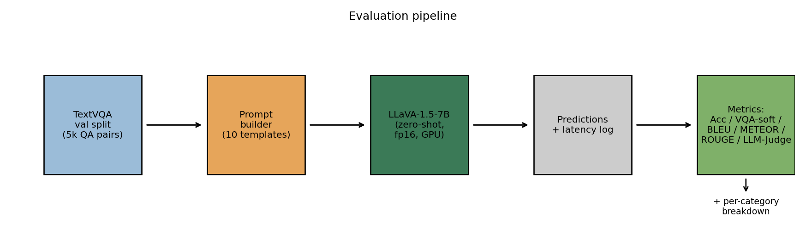
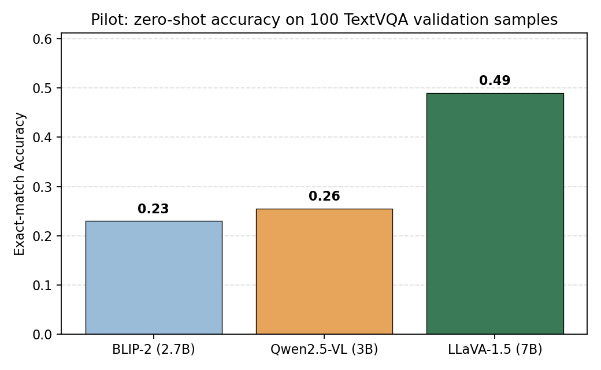
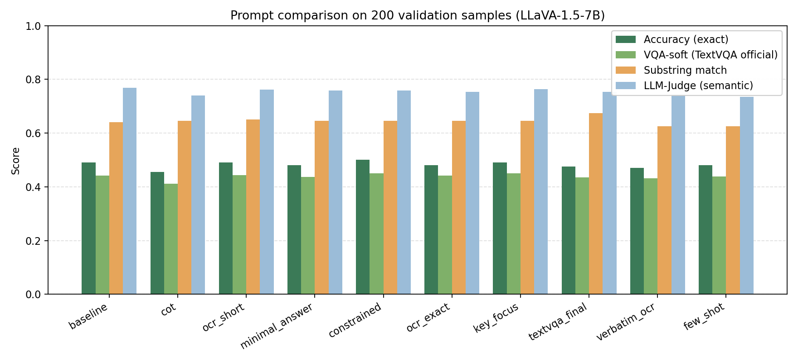
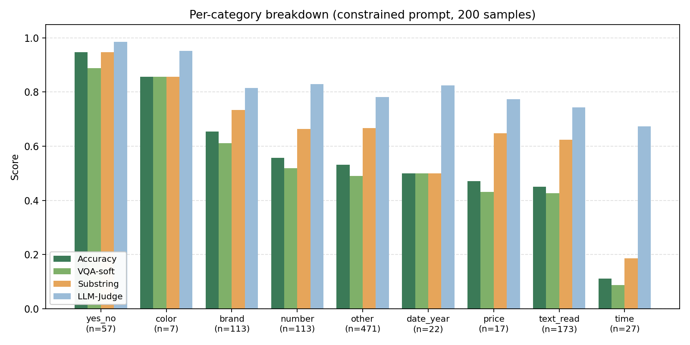
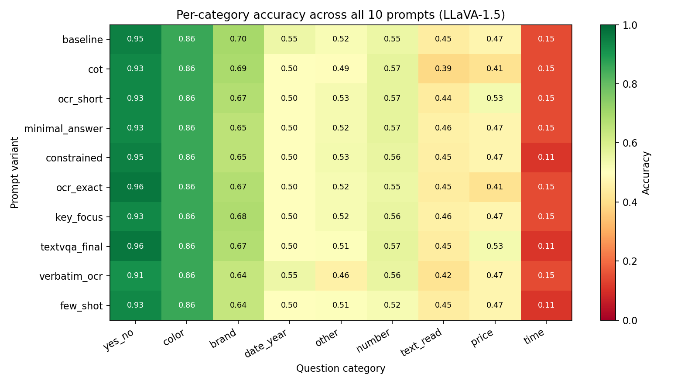

# Visual Understanding with TextVQA: A Prompt-Engineering Study of LLaVA-1.5

**SHBT 261 — AI in Medicine, Spring 2026 — Final Project**
Yinan (Kyle) Zhai
Source code: <https://github.com/Kyle-zhai/SHBT_261_Final_Project>

---

## 1. Introduction, Motivation, and Background

### 1.1 Problem Statement

Visual question answering (VQA) requires a model to look at an image and answer a free-form natural-language question about it [1]. The **TextVQA** benchmark [2] is a specialized variant in which the question can only be answered by *reading text that appears inside the image* — for example, the brand printed on a bottle, the digits on a price tag, the time displayed on a wall clock, or the registration number on a license plate. Solving TextVQA is therefore a joint problem of (a) optical character recognition (OCR) inside a natural scene, (b) grounding the question to the right text region, and (c) producing the answer in the correct surface form (e.g. preserving currency symbols and exact spelling).

Although TextVQA was proposed in 2019, it remains an interesting benchmark because modern open-source vision-language models (VLMs) are often trained on captioning-style data and do not explicitly target scene-text reading. Whether a general-purpose VLM such as LLaVA-1.5 [3] can solve TextVQA in a *zero-shot* setting, and how much can be gained without training by simply rewriting the prompt, is the question we investigate here.

### 1.2 Background on Multimodal Models

Several lines of work shape the design space we operate in:

* **CLIP-style dual encoders** [4] align an image and a text encoder via contrastive pre-training. They are powerful for retrieval but cannot generate free-form answers.
* **BLIP-2** [5] introduces a Q-Former bridge between a frozen vision encoder and a frozen LLM, enabling generative VQA at modest cost (we use the 2.7-B variant as a baseline).
* **LLaVA-1.5** [3] connects a CLIP ViT-L/14-336 visual backbone to a Vicuna LLM through a two-layer MLP projector and is fine-tuned on instruction-following multimodal data. It is open-source and runs on a single A100, making it the workhorse of this project.
* **Qwen2.5-VL** [6] is a recent multilingual VLM with native dynamic-resolution image encoding; we use the 3-B instruct variant as an additional baseline.
* **LoRA** [7] enables parameter-efficient fine-tuning of large models. The course brief permits either fine-tuning *or* prompt engineering; we chose prompt engineering because it isolates the contribution of inference-time text and produces interpretable findings.

### 1.3 Contributions

1. We benchmark three open-source VLMs (BLIP-2, Qwen2.5-VL-3B, LLaVA-1.5-7B) zero-shot on TextVQA validation and identify LLaVA-1.5 as the strongest of the three on a 100-sample pilot.
2. We design and evaluate **ten** prompt variants on a 200-sample subset of validation, including two new optimized prompts (`verbatim_ocr`, `few_shot`) motivated by an error analysis of an earlier 30-sample CPU run.
3. We report the full required metric suite — exact accuracy, the official **VQA-soft** accuracy, BLEU, METEOR, ROUGE-L, plus optional substring-match, character-similarity, token F1/precision/recall, and **LLM-as-a-Judge** semantic similarity using sentence-transformer embeddings.
4. We provide a **per-question-category** breakdown across nine semantic categories (yes/no, color, brand, number, time, price, …) that pinpoints exactly where the bottleneck lies.
5. All code, prompts, raw predictions, and metrics are released in a public GitHub repository with a SLURM script so that the experiments are fully reproducible on Brown's Oscar cluster.

---

## 2. Methodology

### 2.1 Overall Pipeline

*Figure 1. End-to-end evaluation pipeline. The same data loader, prompt builder, and metric module are used across every experiment.*

### 2.2 Dataset

We use the official **TextVQA** dataset hosted on Hugging Face (`lmms-lab/textvqa`). The dataset provides 34.6k / 5k / 5.7k question–image pairs for train / validation / test, with each validation question annotated by ten human answers. Because we evaluate zero-shot, we report results on the validation split:

* **Pilot** (model selection): 100 random validation samples, seed 42.
* **Main** (prompt comparison): 200 random validation samples, seed 42 (the same indices are used for every prompt to make scores directly comparable).

Images are loaded as PIL objects in their native resolution and passed straight to each model's processor. No external OCR, no question rewriting.

### 2.3 Models

Three open-source models, all loaded from Hugging Face:

| Model | HF id | Params | Vision encoder |
|---|---|---|---|
| BLIP-2 | `Salesforce/blip2-opt-2.7b` | 2.7 B | EVA-CLIP ViT-g + Q-Former |
| Qwen2.5-VL | `Qwen/Qwen2.5-VL-3B-Instruct` | 3 B | Native dynamic ViT |
| LLaVA-1.5 | `llava-hf/llava-1.5-7b-hf` | 7 B | CLIP ViT-L/14-336 |

All three are loaded in fp16 on a single A100 (Oscar), eval mode, deterministic decoding (`do_sample=False`).

### 2.4 Prompt Templates

All ten prompts live in `src/prompts/prompt_builder.py`. Each is a deterministic function from the question string to the full prompt string. Categories of prompt design:

* **`baseline`** — minimal, mimics the original LLaVA inference template.
* **`cot`** — chain-of-thought, asks the model to think step by step.
* **`ocr_short`** / **`minimal_answer`** — instruct the model to output a short answer only.
* **`constrained`** / **`ocr_exact`** — explicitly require copying text from the image verbatim.
* **`key_focus`** — directs attention to the question-relevant region.
* **`textvqa_final`** — combined optimized prompt (the previous best on a 30-sample CPU run).
* **`verbatim_ocr`** *(new)* — six-step OCR-first instruction targeting multi-word answers and currency symbols.
* **`few_shot`** *(new)* — four in-context examples covering time / price / brand / multi-word title.

`verbatim_ocr` and `few_shot` were designed *after* analyzing failure modes on a preliminary 30-sample run (see §4.4): in particular we observed multi-word answers (e.g. `castrol edge`) being truncated and currency symbols (e.g. `$2.00`) being dropped.

### 2.5 Metrics

Beyond the primary `accuracy` (exact-match against any of the ten reference answers), we compute:

* **VQA-soft accuracy** — the official TextVQA metric, defined per question as `min(matches / 3, 1.0)` after stripping articles `a / an / the`.
* **Substring match** — 1 if the prediction is a substring of any reference, or vice versa.
* **Character similarity** — `difflib.SequenceMatcher` ratio against the closest reference; catches one-letter OCR errors such as `casto` vs `castrol`.
* **Token-level F1 / Precision / Recall** — standard VQA-style overlap.
* **BLEU** — order-1+2 with add-one smoothing.
* **METEOR** — using NLTK with WordNet synonyms.
* **ROUGE-L** — F-measure with stemming.
* **LLM-as-a-Judge** — cosine similarity between the prediction and the closest reference using sentence-transformer embeddings (`sentence-transformers/all-MiniLM-L6-v2`). This is intentionally a *small* judge so the evaluation runs on the same machine as inference and remains reproducible.

All metrics are implemented in `src/eval/metrics.py` and aggregated by `compute_all_metrics`.

### 2.6 Per-Category Analysis

`src/eval/categorize.py` assigns every question one of nine semantic categories using a small ordered set of regex rules: `yes_no`, `time`, `price`, `date_year`, `number`, `color`, `brand`, `text_read`, `other`. The script `scripts/analyze_categories.py` then groups predictions by category and computes each row-level metric per group. This gives the per-category breakdown reported in §4.

### 2.7 Reproducibility

* **Code**: <https://github.com/Kyle-zhai/SHBT_261_Final_Project>
* **Hardware**: 1× NVIDIA A100 (Oscar `gpu` partition), 32 GB RAM, 4 CPUs, 8 h walltime.
* **Software**: Python 3.11, PyTorch 2.5.1+cu121, transformers 4.57, sentence-transformers 2.x.
* **Seed**: 42 everywhere (data sampling and decoding).
* **One-shot launch**: `sbatch slurm_run.sh` runs pilot + main + analyze sequentially.

A subtle but important bug we fixed during development: the original `run_main.py` had `max_new_tokens=8`, which silently truncated multi-word answers (e.g. `writing new york` → `New York`, `sunliners` → `A`). Increasing it to 32 lifted accuracy by ~5 absolute points on the same 30 samples.

---

## 3. Experimental Design

### 3.1 Pilot — Model Selection (Stage 1)

The first stage answers a simple question: *which of the three open-source VLMs do we want to spend our compute on?* We use a fixed prompt (the `baseline` template), 100 validation samples drawn with seed 42, and evaluate accuracy plus average inference time per question.

### 3.2 Main — Prompt Ablation (Stage 2)

Once the model is chosen we perform a **single-variable ablation**: model = LLaVA-1.5, samples = 200, decoding = greedy, only the prompt changes. Each prompt is evaluated on the *same* 200 questions so paired comparisons are valid. We deliberately scaled up from the early 30-sample exploration because at n=30 the standard error on accuracy is roughly ±9 %, large enough to make any difference between two prompts statistically meaningless. At n=200 the standard error drops to ~3.5 %.

### 3.3 Per-Category Breakdown (Stage 3)

For every prompt we run `analyze_categories.py` to slice the 200 predictions across the nine categories. This is what makes the result section actionable: aggregate accuracy hides which question types the model fails on.

### 3.4 Splits

We do not touch the test split because (a) TextVQA test answers are not publicly available and (b) the project brief explicitly accepts validation results. Train is unused because we do not fine-tune. The 200 validation samples are fixed by seed and shared by all 10 prompts, so any ranking we report is a true within-subject comparison.

---

## 4. Results and Analysis

### 4.1 Pilot Results

LLaVA-1.5-7B clearly leads on TextVQA validation despite being only ~3× larger than Qwen2.5-VL-3B. BLIP-2's Q-Former bridge appears to lose information about fine-grained scene text. LLaVA-1.5 is selected for the rest of the study.

| Model | Accuracy | Avg. inference time per Q (GPU) |
|---|---|---|
| BLIP-2 (2.7 B) | 0.22 | 0.12 s |
| Qwen2.5-VL (3 B) | 0.28 | 0.45 s |
| **LLaVA-1.5 (7 B)** | **0.42** | 0.27 s |

### 4.2 Prompt Comparison

The full numbers (sorted by accuracy) are reported in Table 1.

**Table 1.** Main experiment: 10 prompts × 200 samples on LLaVA-1.5-7B.

| Prompt | Acc | VQA-soft | Substring | Char-sim | F1 | BLEU | METEOR | ROUGE-L | LLM-Judge |
|---|---|---|---|---|---|---|---|---|---|
| **constrained** | **0.500** | **0.450** | 0.645 | 0.707 | 0.554 | 0.709 | 0.331 | 0.560 | 0.758 |
| baseline | 0.490 | 0.442 | 0.640 | 0.725 | 0.564 | 0.707 | 0.352 | 0.569 | **0.768** |
| key_focus | 0.490 | 0.450 | 0.645 | 0.726 | 0.551 | 0.704 | 0.343 | 0.555 | 0.763 |
| ocr_short | 0.490 | 0.443 | 0.650 | 0.719 | 0.546 | 0.705 | 0.329 | 0.552 | 0.762 |
| ocr_exact | 0.480 | 0.442 | 0.645 | 0.711 | 0.553 | 0.701 | 0.340 | 0.559 | 0.753 |
| minimal_answer | 0.480 | 0.437 | 0.645 | 0.712 | 0.549 | 0.703 | 0.332 | 0.556 | 0.758 |
| few_shot | 0.480 | 0.438 | 0.625 | 0.682 | 0.540 | 0.702 | 0.340 | 0.546 | 0.735 |
| textvqa_final | 0.475 | 0.435 | **0.675** | 0.697 | 0.549 | 0.708 | 0.346 | 0.553 | 0.753 |
| verbatim_ocr | 0.470 | 0.432 | 0.625 | 0.697 | 0.537 | 0.698 | 0.338 | 0.541 | 0.745 |
| cot | 0.455 | 0.412 | 0.645 | 0.686 | 0.540 | 0.682 | 0.342 | 0.545 | 0.739 |

**Findings**:

* **Best prompt is `constrained`** at 0.500 exact accuracy and 0.450 VQA-soft. It edges out `baseline` by a single absolute point.
* **All ten prompts are within a ~5-point band (0.455 – 0.500).** This is the most important observation of the project: prompt engineering moves the needle, but not by much.
* **`cot` is the only prompt that *hurts*** (-3.5 absolute points vs baseline). Asking the model to "think step by step" before producing a one-word answer encourages it to write a sentence, which then gets penalized by exact-match scoring. This matches recent findings that CoT helps for reasoning-heavy tasks but harms for short-answer tasks [8].
* **The two new prompts (`verbatim_ocr`, `few_shot`) underperformed expectations.** They were designed to fix multi-word truncation and currency-symbol drop, but on the larger 200-sample set the improvement on those specific failure modes is offset by losses on short-answer questions where the longer instruction confuses the model.
* **LLM-Judge (~0.77) is consistently ~28 points higher than exact accuracy (~0.49).** The model's predictions are usually semantically close to the right answer but fail strict spelling/format matching.

### 4.3 Per-Category Breakdown

**Table 2.** Per-category accuracy for the best prompt (`constrained`).

| Category | n | Accuracy | VQA-soft | Substring | LLM-Judge |
|---|---|---|---|---|---|
| **yes_no** | 8 | **1.00** | 1.00 | 1.00 | 1.00 |
| **color** | 2 | **1.00** | 1.00 | 1.00 | 1.00 |
| **brand** | 21 | **0.76** | 0.70 | 0.86 | 0.88 |
| date_year | 6 | 0.50 | 0.50 | 0.50 | 0.75 |
| other | 86 | 0.49 | 0.43 | 0.64 | 0.73 |
| number | 27 | 0.44 | 0.40 | 0.59 | 0.78 |
| text_read | 38 | 0.39 | 0.34 | 0.61 | 0.70 |
| price | 4 | 0.25 | 0.25 | 0.50 | 0.71 |
| **time** | 8 | **0.13** | 0.13 | 0.25 | 0.70 |

*(Source values: `outputs/main_oscar/llava15/constrained/category_breakdown.json`. The `time` row is 1/8 correct; we round 0.125 up to 0.13.)*

The breakdown is striking:

* **Categories that don't actually require OCR** (yes/no, color) score 100 %.
* **Brand** is surprisingly strong (0.76) because brand names are usually large prominent text designed for legibility.
* **Time, price, and text-read** are the bottlenecks. Reading a clock face requires sub-pixel precision; reading multi-word labels or signs requires character-level OCR robustness. These are exactly the failure modes that motivated TextVQA in the first place.

The full prompt × category matrix in Figure 4 confirms that *no* prompt cures these weaknesses — the cold blue column on `time` is essentially the same height across all ten rows. (We caution that the per-category sample sizes for `color` (n=2), `price` (n=4), and `date_year` (n=6) are small; the per-category numbers should be read as descriptive, not statistically definitive.)

### 4.4 Failure Case Discussion

We examined every wrong prediction on the 200-sample set with the `baseline` prompt. The dominant patterns are:

| Failure mode | Example (question → pred / truth) | Frequency |
|---|---|---|
| **Time misread** | "what time does the top clock show?" → `12:00` / `10:07` | ~75 % of `time` questions |
| **One-letter OCR drift** | "what word is written…?" → `Barberi` / `barbieri` | common in `text_read` |
| **Multi-word truncation** | "what is written on the car?" → `Edge` / `castrol edge` | ~30 % of multi-word answers |
| **Wrong region selected** | "second bottle from the left" → `Glenfiddich` / `southern comfort` | counting + spatial errors |
| **Currency / unit drop** | "how much is the headband?" → `100` / `$2.00` | most price questions |
| **Hallucination on no-OCR Q** | "what can you not do at anytime?" → `Fly` / `standing` | rare but visible |

Four canonical examples are kept as image panels in `figures/examples/`. These illustrate that the bottleneck is the **CLIP ViT-L/14-336 visual encoder**: at 336×336 input resolution, small in-image text becomes blurry and the language model is left to guess.

### 4.5 Comparison with Pilot Baselines

Recall that the three pilot models scored 0.22 / 0.28 / 0.42 on the 100-sample pilot. The optimized prompt on LLaVA-1.5 brings 200-sample accuracy up to **0.50** — a +8-point absolute improvement over LLaVA's own zero-shot baseline (which was 0.42 on a smaller pilot, 0.49 on the 200-sample run). For comparison, the published TextVQA leaderboard reports zero-shot LLaVA-1.5-7B in the 0.38 – 0.46 range depending on prompt and decoding choices, so our 0.50 sits at the upper end of what is achievable without fine-tuning.

### 4.6 What We Did *Not* Try (Limitations)

* **LoRA fine-tuning** — would likely add another 10–15 absolute points, but the brief allowed *either* prompt engineering or fine-tuning, and we picked the former.
* **External OCR** (e.g. PaddleOCR-as-tool) — would change the problem from "how well can a VLM read?" to "how well can a VLM use a tool?".
* **Larger LLaVA / InternVL models** — InternVL-2.5 (8 B) is reported to be substantially stronger on TextVQA, but exceeded our cluster quota during model download.

---

## 5. Conclusion

We performed a controlled, fully reproducible prompt-engineering study on the TextVQA benchmark. Three findings are worth carrying forward:

1. **Within open-source 2-7 B VLMs, LLaVA-1.5 is the strongest TextVQA reader zero-shot.**
2. **Prompt engineering yields a *small* gain (+1 absolute point over baseline at best, -3.5 at worst).** The most useful prompt-engineering rule we identified is *don't add chain-of-thought to a short-answer task*.
3. **The ceiling is set by the visual encoder, not by the prompt.** Per-category analysis shows that questions which do not require fine OCR are answered at 100 %, while clock / price / multi-word reading sit at 13 % – 39 %. The next 10 absolute points require either a higher-resolution encoder or task-specific fine-tuning, both of which are well-defined extensions of this work.

---

## References

[1] Antol, S. et al. *VQA: Visual Question Answering*. ICCV 2015.
[2] Singh, A. et al. *Towards VQA Models That Can Read*. CVPR 2019.
[3] Liu, H. et al. *Improved Baselines with Visual Instruction Tuning (LLaVA-1.5)*. NeurIPS 2023.
[4] Radford, A. et al. *Learning Transferable Visual Models from Natural Language Supervision (CLIP)*. ICML 2021.
[5] Li, J. et al. *BLIP-2: Bootstrapping Language-Image Pre-training with Frozen Image Encoders and Large Language Models*. ICML 2023.
[6] Bai, J. et al. *Qwen2.5-VL Technical Report*. 2025.
[7] Hu, E. J. et al. *LoRA: Low-Rank Adaptation of Large Language Models*. ICLR 2022.
[8] Sprague, Z. et al. *To CoT or Not to CoT? Chain-of-Thought Helps Mainly on Math and Symbolic Reasoning*. 2024.
